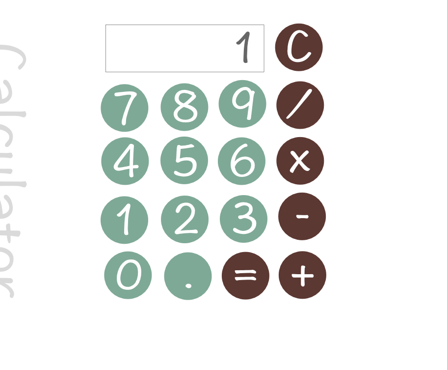

## Calculator
This is the third front-end project for [freecodecamp.com](freecodecamp.com). You have to create a simple calculator.

## Hosted on [Github](http://newyork-anthonyng.github.io/fcc_calculator/)

## Tools Used
jQuery, HTML and SCSS/CSS

## User Stories
  * User can add, subtract, multiply and divide two numbers
  * User can clear the input field with a clear button
  * User can keep chaining mathematical operations together until they hit the equal button, and the calculator will show the correct answer

## Wireframes
  
